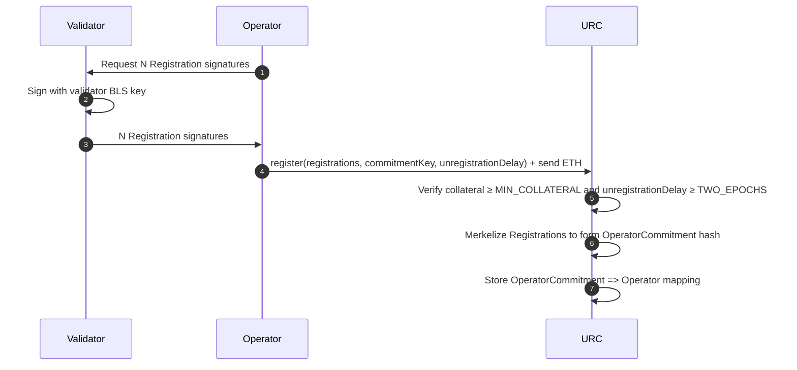
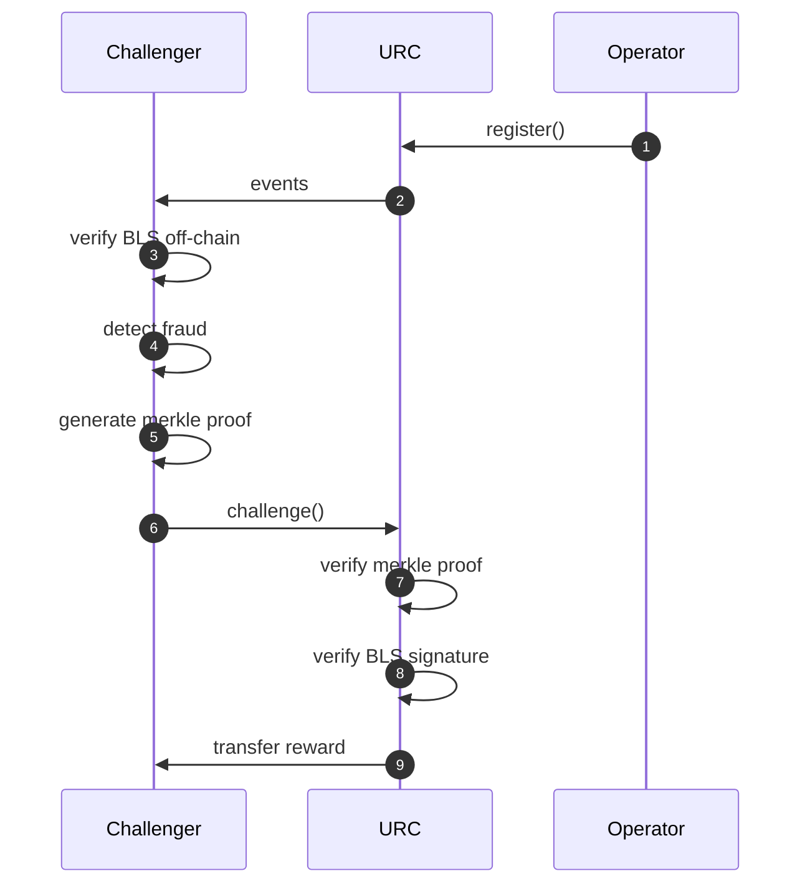

# preconfs

## Milestones
- [X] Batch register an operator (cheaply)
- [X] Unregister/Claim collateral
- [X] Slash with bytecode
- [ ] Slash with `Slasher` contract address
- [ ] Social consensus?
- [ ] ERC?

## TODOs

[Registry.sol](src/Registry.sol)
- [x] Reduce `MIN_COLLATERAL` to 0.1 ETH. It needs to be non-zero to incentivize people to slash bad registrations.
- [X] Rename `proxyKey` to `commitmentKey`.
- [X] ~~Optimistically accept an `OperatorCommitment` hash. It can be proven as fraudulent by generating the merkle tree in the fraud proof.~~
- [X] Make the unregistration delay parameterizable by the proposer but requires it to be at least `TWO_EPOCHS`.
- [X] Spec out the `Registration` message signed by a Validator BLS key.
- [X] Diagram the registration process
- [ ] Successful challenger gets to claim the collateral (how much?). 
- [ ] Make sure no one can overwrite an `OperatorCommitment`
- [ ] Save the `Operator.collateral` as GWEI.


[BytecodeSlasher.sol](src/BytecodeSlasher.sol)
- [x] If we want to support 'stateful' slashing contracts we should consider signing `slasherAddress || functionSelector` and invoking that instead of deploying and executing bytecode.
- [ ] Replace BytecodeSlasher concept with a way to call a `Slasher` contract address. 
- [ ] Update the `Slasher` interface to include the slashing evidence, signed bytecode, operator commitment, proxy key, and function selector.
- [ ] Any additional modifiers needed? 
- [ ] Verify the `Commitment` signature inside the `Slasher` 
- [ ] Successful challenger gets to claim the collateral (how much?).


## Schemas
```
struct RegistrationMessage {
    // compressed ECDSA key without prefix used to sign `Delegation` messages
    bytes32 commitmentKey; 

    // the address that can unregister and claim collateral
    address operator; 

    // the number of blocks to wait before the operator can unregister
    uint16 unregistrationDelay; 
}
```

```
struct RegistrationMessage {
    // Validator's compressed BLS public key
    bytes validatorPubkey; 

    // Key used to sign this container
    bytes32 commitmentKey; 

    // Hash of the slashing bytecode to be executed
    bytes32 bytecodeHash;

    // Arbitrary metadata to be included in the delegation (we should include the OperatorCommitment)
    bytes metadata; 
}
```

## Optimistic Registration Process
The Optimistic Registration system allows validators to register for proposer commitment services with minimal upfront verification, while maintaining security through a fraud-proof window. 

### Off-Chain Preparation
For each validator to register, the operator signs a `RegistrationMessage` with their validator's BLS key. This action binds the validator key to a `commitmentKey` (ECDSA) used to sign off-chain proposer commitments. They also select a `withdrawalAddress` that can unregister and claim collateral. The `withdrawalAddress` wallet does not interact with the preconf supply chain and can be in cold storage or a multisig.

```solidity
struct RegistrationMessage {
    bytes32 commitmentKey;
    address withdrawalAddress;
    uint16 unregistrationDelay;
}
```

### register()
```solidity
function register(
    Registration[] calldata registrations,
    bytes32 commitmentKey,
    address withdrawalAddress,
    uint16 unregistrationDelay,
    uint256 height
) external payable;
```

The operator supplies at least `MIN_COLLATERAL` Ether to the contract and batch registers the N validators. To save gas, the contract will not verify the signatures of the `Registration` messages. Instead, the function will merkleize the inputs to a root hash called the `OperatorCommitment`. This is mapped to an `Operator` struct containing the minimal required fields at just two storage slots.

```solidity
struct Operator {
    bytes32 commitmentKey; // compressed ecdsa key without prefix
    address withdrawalAddress; // can be a multisig or same as commitment key
    uint56 collateral; // amount in gwei
    uint32 registeredAt; // block number 
    uint32 unregisteredAt; // block number
    uint16 unregistrationDelay; // block number 
}
```



### slashRegistration()
After registration, a fraud proof window opens during which anyone can challenge invalid registrations. Fraud occurs if a validator BLS signature did not sign over the `commitmentKey`, `withdrawalAddress`, and `unregistrationDelay` submitted during registration. To prove fraud, the challenger first provides a merkle proof to show the `signature` is part of the `OperatorCommitment` merkle tree. Then the `signature` is verified using the on-chain BLS precompiles. 

If the fraud window expires without a successful challenge, the operator would be eligible to be considered by preconf protocols.

```solidity
function slashRegistration(
    bytes32 operatorCommitment,
    BLS12381.G1Point calldata pubkey,
    BLS12381.G2Point calldata signature,
    bytes32 commitmentKey,
    bytes32[] calldata proof,
    uint256 leafIndex
) external view;
```



## Slasher
To opt-in to preconfs, operators will commit to slashing conditions by signing and distributing messages off-chain with their `commitmentKey`. To support general slashing logic, the initial idea was to have operators commit to a bytecode hash. Upon slashing, the URC would deploy and execute the bytecode. The return value of the function call is the number of GWEI to be slashed.

This approach has the following drawbacks:
- Executing bytecode requires deploying it which eats into the gas limit.
- The approach cannot be used for stateful slashing logic, e.g., fraud proofs.

To address these drawbacks, we replace commitments to bytecode with commitments to arbitrary `Slasher` contract addresses. To slash an operator, anyone can call `slash(bytes inputs)` on their committed slasher contract (each slasher contract is expected to implement this interface). Similarly, the return value of the function call is the number of GWEI to be slashed.

This approach has the following benefits:
- Each `Slasher` contract only needs to be deployed once and can be verified on-chain.
- Arbitrary stateful logic can be executed on the `Slasher`. (e.g., a fraud proof game is played ahead of time and then calling `slash(bytes inputs)` returns the slashing outcome)